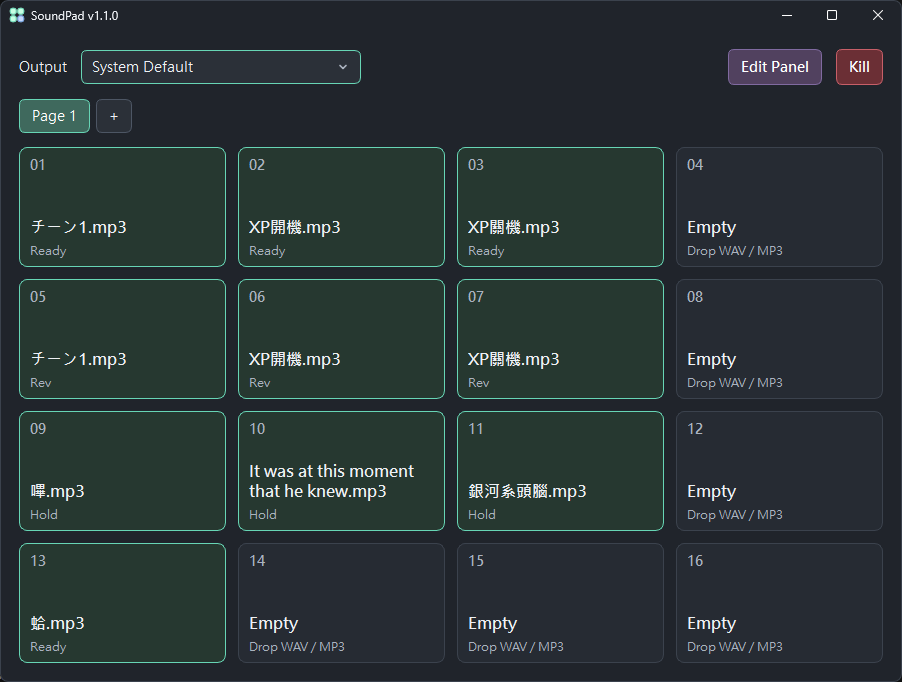
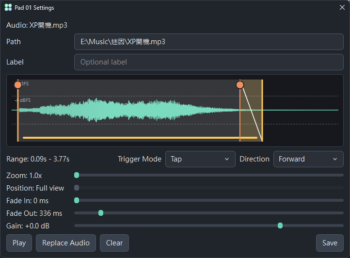

# SoundPad

SoundPad 是一個音效板 GUI



1. 每頁有 16 個 pad, 可以新增無限多頁
2. drag-and-drop 放入 WAV 或 MP3
3. 在主畫面選擇音訊輸出裝置
4. 開始玩你的音效版
5. 如果玩得太兇或音檔太長變得混亂, 用 `Kill` 來中斷所有播放中的音效
6. `Edit Panel` 模式下可以拖曳整理音效版，右鍵拖曳可以複製版塊



7. 右鍵 pad 調整 trim range, fade in/out, gain, playback settings...
8. 在 waveform 上滾輪縮放, 中鍵 (或 space + 左鍵) 拖動; 右鍵可以快速 preview


## 可運行系統

* Windows 10 + 已測試
* macOS Apple Silicon 已測試 (arm64; Intel 版本未測試)
* Linux 未測試


## MP3 解碼依賴 ffmpeg

如果你只用 WAV, 可以不裝

如果放入 MP3 後無法正常讀取, 請確認系統中已安裝並可使用 `ffmpeg`

Windows 推薦用 `winget` 安裝：

```powershell
winget install Gyan.FFmpeg
ffmpeg -version
```

macOS 推薦用 Homebrew 安裝：

```sh
brew install ffmpeg
ffmpeg -version
```

## 免安裝版

可以到 GitHub Releases 下載免安裝可執行檔

Windows 版下載 `SoundPad-Windows.zip`, 解壓後會是:

```text
SoundPad/
  SoundPad.exe
  soundpad/
    theme.toml
    assets/
```

執行 `SoundPad.exe` 即可啟動, 程式會在同一個資料夾建立本機資料:

```text
SoundPad/
  cache/
  soundpad/config.toml
```

macOS 版下載 `SoundPad-macOS.zip`, 解壓後開啟 `SoundPad.app` (可能需要賦予權限才能執行, 詳細請看 release note) 

macOS 版的設定文件與 cache 會放在:

```text
~/Library/Application Support/SoundPad/
```

## 手動安裝

確保系統已安裝:
* Python 3.14
* uv

clone 專案後, 在專案目錄中執行:

```sh
uv sync
```


## 手動安裝啟動方式

Windows：

```bat
soundpad.bat
```

macOS：

```sh
./soundpad.command
```

Linux / WSL：

```sh
./soundpad.sh
```

如果在 macOS 或 Linux 執行時出現權限不足, 請先執行：

```sh
chmod +x soundpad.command soundpad.sh
```
